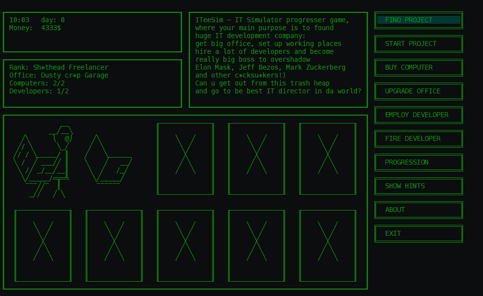

### IteeSim

Requirements:

Unix system and Ruby)

Gem 'Curses', (im usin' it to hide cursor only)
so after cloning rep use:

$ gem install curses

Then, just run:

$ ruby run.rb

How to play?

* U could learn everything about gameplay by clicking HINTS button

About creating:

I was coding the game just to train OOP, SOLID and Ruby,
but it turned out really good, funny and playable.

Everything works fine, but there is one thing to do -
fix formulas, cause order completion is too fast,
rewards for it r too big; developers salaries r too high,
cause passive gaining from rank too low...It is not coding problem,
just some gameplay fix, but im so tired of perspectivless coding, i wanna
find job, hire me, im cool developer!)

